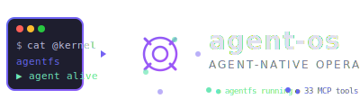

<p align="center">
  
</p>

<p align="center">
  <strong>让 AI coding agent 拥有「原生 OS 体验」</strong>
</p>

<p align="center">
  <a href="https://github.com/buzzcut2190/agent-os/blob/main/LICENSE"></a>
  <a href="https://github.com/buzzcut2190/agent-os/actions"></a>
  <a href="https://go.dev/"></a>
  <a href="https://github.com/buzzcut2190/agent-os/releases"></a>
</p>

---

**agent-os** 是一个面向 AI coding agent 的原生操作系统。不是"给 AI 用的文件系统"，而是让 agent 可以真正「安家」的地方——有文件系统、有内核调度、有守护进程、有家目录。

当你把 agent-os 挂载到一个项目目录：

```bash
agentfs mount . .agentfs/mnt
```

你的项目立刻多了 13 个语义目录——AI agent 可以用 `ls` / `cat` 直接与项目交互，不需要任何 API 调用：

| 目录 | 它能做什么 |
|------|-----------|
| `@context` | 自动生成的项目摘要——技术栈、结构、统计 |
| `@search` | 按函数/类/符号/类型浏览代码 |
| `@graph` | 依赖图谱、调用图、导入关系（DOT 格式） |
| `@refactor` | 死代码检测、圈复杂度、lint 报告 |
| `@team` | 多 Agent 团队协作空间 |
| `@tasks` | 任务看板 + 依赖 DAG |
| `@skills` | 7 个内置技能——代码审查 / 测试生成 / 文档 / 提交信息 / 审计 等 |
| `@providers` | 5 个 LLM 提供商——Anthropic / OpenAI / DeepSeek / GLM / Ollama |
| `@memory` | 持久记忆——会话 / 决策 / 偏好 / 知识 |
| `@bridges` | 远程桥接——飞书 / Webhook |
| `@kernel` | Agent 内核——进程调度 / IPC / 资源控制 |
| `@daemon` | 守护进程——文件监控 / 定时任务 / 报告 / 挖掘 |
| `@workspaces` | Agent 家目录——团队空间 / 产出物管理 |

---

## 🚀 快速开始

```bash
# 1. 构建
make build

# 2. 初始化项目
agentfs init

# 3. 挂载
agentfs mount . .agentfs/mnt

# 4. 看看你的项目长什么样
cat .agentfs/mnt/@context

# 5. 启动 MCP Server（给 AI agent 调用）
agentfs-mcp serve --transport stdio
```

---

## 🧠 能力栈

```
                        🧠 Agent Kernel
                  调度 · 生命周期 · 资源 · IPC
                        👻 Agent Daemon
                  监控 · 定时 · 报告 · 挖掘
                        🏠 Agent Workspace
                  家目录 · 团队空间 · 记忆
                        🗂️ agentfs
                  13 虚拟目录 · 33 MCP 工具
```

### 三层架构

| 层 | 核心能力 |
|----|---------|
| **🧠 Kernel** | Agent 进程调度、全生命周期管理、资源配额控制、IPC 频道通信、Model Router 按任务路由 LLM |
| **👻 Daemon** | 文件变更监控、YAML 定时任务、定期报告生成推送、潜意识循环（空闲时自动发现模式） |
| **🏠 Workspace** | 每个 Agent 的私有家目录、团队共享空间、分门别类的持久记忆（会话/决策/偏好/知识） |
| **🗂️ agentfs** | FUSE 虚拟文件系统，13 个语义目录，所有功能都通过 `cat` / `ls` 原生暴露 |

### MCP 协议（33 个工具）

AI agent 也可以通过 MCP 协议调用：

| 类别 | 工具 |
|------|------|
| **文件** | `read_file` `write_file` `edit_file` `delete_file` `move_file` `list_dir` `search_files` |
| **代码** | `search_code` `grep_regex` `find_definition` `find_references` `get_file_summary` `count_loc` |
| **项目** | `get_context` `detect_stack` `list_dir` |
| **会话** | `create_session` `get_session` `list_sessions` `session_diff` `discard_session` `commit_session` |
| **技能** | `list_skills` `activate_skill` `deactivate_skill` `get_skill_context` |
| **提供商** | `list_providers` `get_provider` `list_models` `set_api_key` `set_default_model` `switch_provider` `test_provider` |
| **系统** | `ping` |

---

## ⚡ 技能系统

内置 7 个开箱即用的技能：

```bash
agentfs skill list
# → code-review   自动代码审查（安全/性能/风格/最佳实践）
# → test-generator  自动生成测试用例
# → commit-message  从 diff 生成提交信息
# → auto-doc       自动文档生成
# → architectural-review  架构审查（依赖图分析）
# → dependency-audit  依赖审计
# → feedback-synthesis  反馈综合
```

每个技能都有自己的 prompt + context 模板，AI agent 可以直接调用：

```bash
agentfs skill activate code-review
```

---

## 🛠️ Provider 配置

agent-os 支持 5 个 LLM 提供商：

```bash
# 交互式配置
agentfs provider init

# 设置 API Key（加密存储，不落明文）
agentfs provider key deepseek

# 验证
agentfs provider list
# → deepseek  openai-compatible  deepseek-chat,deepseek-v4-flash,deepseek-v4-pro  ok
```

支持：Anthropic · OpenAI · DeepSeek · GLM（智谱）· Ollama（本地）

---

## 📖 文档

| 文档 | 说明 |
|------|------|
| [Getting Started](docs/getting-started.md) | 快速入门 |
| [CLI Reference](docs/cli.md) | 命令参考 |
| [MCP Tools](docs/mcp-tools.md) | MCP 工具参考 |

---

## 🐛 Troubleshooting

### 挂载报 `permission denied`

```bash
fusermount -uz .agentfs/mnt   # 先卸载残留
agentfs mount . .agentfs/mnt   # 重新挂载
```

### 挂载后读取文件报 `错误的文件描述符`

已修复（v0.4.0）。如遇到，请更新到最新版本后重新编译。

### Provider 配置注意

YAML 字段是 snake_case（`base_url`、`api_key`），`agentfs provider init` 会自动生成正确格式。

---

## 📜 License

[MIT](LICENSE) © 2026 [buzzcut2190](https://github.com/buzzcut2190)

---

<p align="center">
  <sub>由 FUSE 驱动 · 用 Go 构建 · 为 AI agent 而生</sub>
</p>
